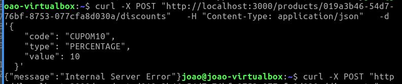

# Teste Técnico

## Sobre o Teste

Este repositório contém um código que simula o cadastro de descontos para um determinado produto.
Leve em consideração o seguinte registro do time de suporte:

```
 O Cliente alega que criou o desconto com valor incorreto, fez a correção, mas o percentual aplicado é incorreto na hora da venda.
```
### Requisição 1
```typescript
POST /products/019a3b46-54d7-76bf-8753-077cfa8d030a/discounts

{
	"code": "CUPOM10",
	"type": "PERCENTAGE",
	"value": 15
}
```

### Requisição 2
```typescript
POST /products/019a3b46-54d7-76bf-8753-077cfa8d030a/discounts

{
	"code": "CUPOM10",
	"type": "PERCENTAGE",
	"value": 10
}
```
## O que será avaliado

### 1. Levando em consideração a análise do suporte, demonstre como foi o processo que o(a) levou a identificação do problema.

Após a análise do projeto, no arquivo `/tech-assessment-7/src/modules/discounts/routes/index.ts` foi verificado que a rota `POST "/products/uuid/discounts"` deveria fazer a criação de um Cupom de desconto, porém estavam sendo aceitos cupons com o mesmo código, fazendo o sistema se confundir e sempre pegar o primeiro cadastrado na chamada a `GET "/products/<uuid>/discounts/<código>"`, não importando se o valor do desconto é diferente. Foi feita a correção no arquivo `/tech-assessment-7/src/modules/discounts/features/createDiscount/CreateDiscountUseCase.ts` que representa o caso de uso da feature `createDiscount`, passando a lançar a excessão `UnableToCreateDiscountError` sempre que já existe Cupom de desconto com o mesmo código que se tenta criar.

Achei curioso que mesmo colocando uma mensagem de erro na excessão `UnableToCreateDiscountError` o erro apresentado no console ao impedir a criação duplicada foi `{"message":"Internal Server Error"}`:


 
### 2. Crie um teste que garanta que não haverá regressão do problema apresentado.

O teste para sempre verificar se o caso de uso está impedindo a criação de Cupons de desconto com o mesmo código seria colocado na pasta `/tech-assessment-7/src/modules/discounts/features/createDiscount` com o nome `CreateDiscountUseCase.spec.ts` conforme especificado em `/tech-assessment-7/vitest.config.ts`.

### 3. Considerando que não existe uma documentação adequada, crie um documento que especifique as regras de negócio envolvidas na criação de um novo desconto.

Conforme falado nos itens anteriores, a regra de criação para um cupom de desconto é que esse cupom siga os dados delineados pelo arquivo `/tech-assessment-7/src/core/entities/Discount.ts`, tendo os seguintes dados:

- **uuid**: ID do cupom.
- **productUuid**: ID do produto ao qual o cupom concede desconto.
- **code**: Código do cupom que será preenchido pelo usuário na tela de checkout.
- **type**: Tipo de cupom, indicando se o desconto é por porcentagem ou por valor fixo.
- **value**: Valor do cupom. Se o tipo for porcentagem, deve estar entre 0 e 100; se for valor fixo, deve ser maior que 0.
- **status**: Status do cupom, indicando se está válido ou não.
- **expiresAt**: Data de expiração a partir da qual o cupom deixa de ser válido ao tentar utilizá-lo na tela de checkout.

### 4. Qual foi o seu entendimento geral da estrutura e organização do projeto? Faça suas considerações.

O projeto está muito bem organizado e fácil de ser extendido. Me impressionou que até mesmo as excessões de erro já estavam criadas pra serem usadas.

---
## Tecnologias Utilizadas

- **Runtime**: Node.js 22.x
- **Linguagem**: TypeScript
- **Framework Web**: Express.js
- **Validação**: Zod
- **Testes**: Vitest
- **Linting**: ESLint
- **Formatação**: Prettier

## Como Executar

```bash
# Instalar dependências
npm install

# Executar em modo desenvolvimento
npm run dev

# Executar testes
npm test

# Build para produção
npm run build

# Executar em produção
npm start

npm run test
```
